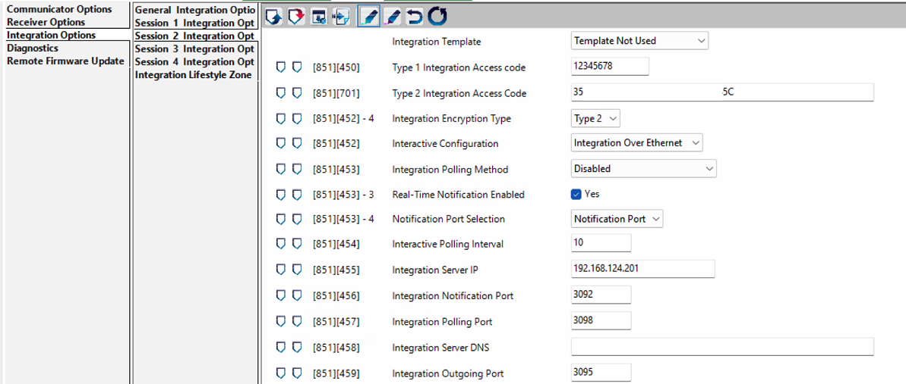
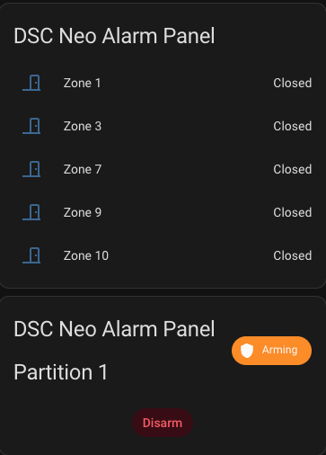

# DSC Powerseries Neo Integration

 _Integrate with DSC Powerseries Neo alarm panel over your local network_

**Repository:** [https://github.com/Z6543/DSC-TLink](https://github.com/Z6543/DSC-TLink)

## Hardware

My setup consists of the following hardware:
- HS2032 - DSC Powerseries Neo alarm panel
- TL280RE - Ethernet communication module.


## Integration Setup Guide

### Prerequisites

- The **installer code** for your DSC panel (default is 5555 or 5555 or 1234 or CAFE, but may have been changed by your installer)
- **DLS5** software (optional, but makes configuration easier) — available from [DSC's documentation site](https://docs.johnsoncontrols.com/dsc/search/all?content-lang=en-US)
- Your TL280 and Home Assistant must be on the **same local network** (or reachable via routing/VPN)

### Step 1: Install the DSC TLink Server Add-on

The relay server runs as a Home Assistant add-on — no separate machine or .NET setup required.

1. In Home Assistant, go to **Settings → Add-ons → Add-on Store**
2. Click the **three-dot menu** (top right) → **Repositories**
3. Add this repository URL: `https://github.com/Z6543/DSC-TLink`
4. Find **DSC TLink Server** in the add-on store and click **Install**
5. Go to the add-on's **Configuration** tab and fill in:

| Option | Description |
|--------|-------------|
| `integration_id` | 10-character integration account ID |
| `encryption_key` | 32-character hex key from `*8[installer code][851][701]` |
| `relay_secret` | A shared secret for encrypted relay communication with HA |
| `panel_port` | Panel listener port (default `3072`) |
| `relay_port` | JSON relay port for HA integration (default `3078`) |
| `log_level` | `info`, `debug`, or `trace` |

6. Click **Start**

The add-on starts automatically with Home Assistant (`boot: auto`). Logs are available in the add-on's **Log** tab.

<details>
<summary><strong>Alternative: Run the server manually</strong></summary>

If you prefer to run the server outside of Home Assistant (e.g., on a separate machine), install the [.NET 8 SDK](https://dot.net/download) and run:

```bash
cd src
dotnet restore "DSC TLink.sln"
dotnet build "DSC TLink.sln"
dotnet run --project Demo/Demo.csproj -- <integrationId> <encryptionKey> --relay-port 3078 --relay-secret <secret>
```

**CLI options:**

| Flag | Default | Description |
|------|---------|-------------|
| `--port <port>` | `3072` | Panel listener port |
| `--relay-port <port>` | `3078` | JSON relay port for Home Assistant |
| `--relay-ip <address>` | `0.0.0.0` | Bind address for the relay (all interfaces) |
| `--relay-secret <secret>` | *(none)* | Shared secret for encrypted relay communication |
| `--debug` | off | Enable debug-level logging |
| `--trace` | off | Enable trace-level logging (most verbose) |

</details>

### Step 2: Configure the TL280 for Integration

The TL280 needs to be configured to connect to your server. This can be done either via DLS5 software or directly on the panel keypad.

#### Option A: Via DLS5 Software
To get the DLS5 software, google "Download DLS5-INT.exe"

Navigate to **Integration Options** > **Session 1 Integration Opt** and configure the following:



| Section | Setting | Value |
|---------|---------|-------|
| `[851][701]` | Type 2 Integration Access Code | Your 32-char hex key |
| `[851][452]-4` | Integration Encryption Type | `Type 2` |
| `[851][452]` | Interactive Configuration | `Integration Over Ethernet` |
| `[851][453]-3` | Real-Time Notification Enabled | `Yes` |
| `[851][453]-4` | Notification Port Selection | `Notification Port` |
| `[851][455]` | Integration Server IP | IP address of your server |
| `[851][456]` | Integration Notification Port | `3072` (default, matches the demo app) |

#### Option B: Via Panel Keypad

Enter `[*][8][installer code][851]` on the keypad to access communicator configuration, then program each section:

1. `[450]` — Set the Type 1 Integration Access Code
2. `[701]` — Set the Type 2 Integration Access Code (32-character hex key)
3. `[452]` — Set Integration Encryption Type to Type 2 (toggle option 4)
4. `[452]` — Set Interactive Configuration to Integration Over Ethernet
5. `[453]` — Enable Real-Time Notification (toggle option 3), set Notification Port Selection to Notification Port (toggle option 4)
6. `[455]` — Enter the IP address of the machine running the server
7. `[456]` — Set to `0C00` (hex for port 3072)

### Step 3: Verify the Connection

After starting the add-on and configuring the TL280, the panel should connect and you will see the ITv2 handshake in the add-on logs (**Log** tab). Once connected, incoming notifications (zone status, arming/disarming events, trouble conditions, etc.) will appear in the logs with their decoded command type and data.

### Step 4: Install the Home Assistant Integration

The project includes a custom Home Assistant integration that receives real-time panel updates via the JSON relay.

**Architecture:**
```
TL280 Panel ──TCP:3072──▶ DSC TLink Add-on ──TCP:3078──▶ HA Integration
                          (decode ITv2)      (JSON relay)   (entities)
```

#### 4a. Install via HACS (recommended)

1. Open **HACS** in Home Assistant
2. Click the **three-dot menu** (top right) → **Custom repositories**
3. Add `https://github.com/Z6543/DSC-TLink` with category **Integration**
4. Find **DSC Powerseries Neo** and click **Install**
5. Restart Home Assistant (**Settings → System → Restart**)

<details>
<summary><strong>Alternative: Manual install</strong></summary>

```bash
scp -r custom_components/dsc_neo/ user@HA_IP:/config/custom_components/dsc_neo/
```

Replace `user` with your HA username (often `root` for HAOS) and `HA_IP` with your Home Assistant IP. Then restart Home Assistant.

</details>

#### 4b. Add the integration

1. Go to **Settings → Devices & Services → Add Integration**
2. Search for **DSC Neo**
3. If using the add-on, enter `localhost` (or `127.0.0.1`) as the server address
4. Enter the relay port (default `3078`) and relay-secret (same as on the DSC add-on).

The integration will test the connection before saving. Make sure the DSC TLink Server add-on is running and that the relay port matches what you configured.

> **Note:** Zone and partition entities are auto-discovered — they will appear as soon as the panel reports zone status or arming events. Open/close a door or arm/disarm from the keypad to trigger initial entity creation.

### Step 5: Import the Dashboard

A pre-built security dashboard is included in the repository.

1. Go to **Settings → Dashboards → Add Dashboard**
2. Name it (e.g., "DSC Neo Alarm"), pick an icon, and save
3. Open the new dashboard → click the 3 dots (⋮) → **Edit Dashboard**
4. Click the 3 dots again → **Raw configuration editor**
5. Paste the contents of [`dashboard/dsc_neo_dashboard.yaml`](https://github.com/Z6543/DSC-TLink/blob/main/dashboard/dsc_neo_dashboard.yaml)
6. Save

The dashboard includes:
- **Alarm Control** — partition tile with arm/disarm/home/night/away mode display
- **Zones** — 8 zone cards with color-coded open/closed state
- **Recent Zone Activity** — 24-hour history graph
- **Partition Details** — ready status, exit delay, and entry delay



> **Tip:** After setup, rename zones to friendly names (e.g., "Front Door", "Living Room Motion") by editing the entities in the HA UI. Entity IDs use the `dsc_neo_alarm_panel_` prefix (e.g., `binary_sensor.dsc_neo_alarm_panel_zone_1`).

### Testing Arm/Disarm Commands via the Relay

You can test commands directly against the relay server using `echo` and `nc` (netcat). The relay accepts JSON-line commands on the relay port (default 3078).

**Arm away:**
```bash
echo '{"type":"arm_away","partition":1,"code":"1234"}' | nc localhost 3078
```

**Arm stay (home):**
```bash
echo '{"type":"arm_home","partition":1,"code":"1234"}' | nc localhost 3078
```

**Arm night:**
```bash
echo '{"type":"arm_night","partition":1,"code":"1234"}' | nc localhost 3078
```

**Disarm:**
```bash
echo '{"type":"disarm","partition":1,"code":"1234"}' | nc localhost 3078
```

Replace `1234` with your panel's access code. The command will be queued and sent to the panel within ~2 seconds. Check the server logs for `Panel command response: Success` to confirm.

## TODO

- [x] ~~Better integrate C# server into Home Assistant~~ — solved with the HA add-on (automatic install, config UI, managed lifecycle)
- [x] ~~Reduce command latency~~ — solved with 2s poll timeout when relay is active

## What is known so far (Jan-2024)

I have seen that it is possible to communicate with the alarm panel over the local network through the TL280 and see the status of the various zones as well as programming and configuration using the DLS5 software tool.  I believe that control of the arming and disarming is also possible, but I havent actually seen that yet. Seeing this was enough confirmation to make the investment of figuring out how to do this myself.

The communication begins by opening a TCP connection with the TL280 on port 3062.  The TL280 will immedietly send a packet of 56 bytes that eventually can be parsed into information about the alarm panel such as device ID, software revision, and several other fields that may or may not be interesting.  From this point on, all communications are encrypted using an AES ECB block cipher.  The key for the cipher is a mashup of data that is sent in the initial data packet from the TL280.  So far, the project can connect and parse this data.  I have verified that I can generate the correct key and successfuly decode the AES cipher.


